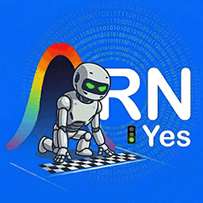

# Antigravity ARN-YES 🚦

🌍 **Language / Langue / 语言 / Idioma / لغة / ภาษา:** [Français](#français) | [English](#english) | [中文](#中文) | [Español](#español) | [العربية](#العربية) | [ภาษาไทย](#ภาษาไทย)

---

## Français

Une extension minimaliste pour Antigravity IDE, conçue pour fluidifier le flux de travail avec les agents IA tout en conservant une architecture locale et sécurisée.

⚠️ **Statut : Déprécié (Obsolète depuis le 07/04/2026 avec Antigravity 1.22.2)**

*J'ai initialement développé cet outil pour résoudre un problème d'ergonomie de l'IDE Antigravity : l'obligation de valider manuellement chaque commande terminal. L'éditeur ayant fini par intégrer cette fonctionnalité nativement (via l'option "Auto-continue"), cette extension n'est techniquement plus requise.*

### 🚦 Fonctionnalité principale

L'extension ajoute un indicateur visuel cliquable (`ARN-Yes🚦`) dans votre barre d'état (Status Bar), qui change de couleur selon son état :

* **Quand elle est sur ON (Vert) :** Elle surveille silencieusement l'arrière-plan (via un système de polling toutes les 2 secondes) pour détecter les requêtes d'exécution de l'agent. Elle les approuve automatiquement via l'API RPC de l'IDE, permettant une autonomie totale de l'IA (mode auto-run).
* **Quand elle est sur OFF (Rouge) :** L'extension suspend son processus de vérification et rend le contrôle d'approbation manuel à l'éditeur.

### 🛡️ Architecture & Ingénierie (Secure by Design)

Contrairement aux solutions tierces qui exposent des ports globaux risqués ou nécessitent de lourdes dépendances NPM, ARN-YES repose sur une ingénierie locale stricte et sécurisée avec 0 dépendance externe :

* **Moteur de Découverte Dynamique :** L'extension ne force aucun port insécurisé. Elle utilise des processus natifs de l'OS (`ps`/`lsof` sur Unix, et l'exécution d'un script temporaire généré localement `discover_token.ps1` sur Windows) pour analyser l'environnement, localiser le *Language Server* d'Antigravity, et extraire dynamiquement son port d'écoute et son Token CSRF.
* **Communication RPC Locale :** Une fois le token sécurisé obtenu, l'extension s'interface directement avec l'API gRPC-Web locale sur `127.0.0.1` en HTTPS (et le port HTTP `60001` pour fermer l'overlay UI). Aucune donnée ne quitte votre machine.
* **Compartimentation recommandée :** L'automatisation des commandes système comporte des risques inhérents (ex: *indirect prompt injection*). Il est vivement recommandé d'exécuter vos projets assistés par IA dans des environnements conteneurisés ou des machines virtuelles isolées.

### 💻 Installation via VSIX 

1. Téléchargez le fichier `antigravity-arn-yes.vsix`.
2. Dans Antigravity IDE, ouvrez la vue des Extensions (`Ctrl+Shift+X`).
3. Cliquez sur le menu "..." (Vues et plus d'actions) en haut de la barre latérale.
4. Sélectionnez **Installer à partir d'un VSIX...**
5. Choisissez le fichier téléchargé et redémarrez l'IDE.

### 📄 Licence

Ce projet est distribué sous la licence [GPL v3](https://www.gnu.org/licenses/gpl-3.0.html).

---

## English

A minimalist extension for Antigravity IDE, designed to streamline the workflow with AI agents while maintaining a local and secure architecture.

⚠️ **Status: Deprecated (Obsolete since April 7, 2026 with Antigravity 1.22.2)**

*I initially developed this tool to solve an ergonomic issue in the Antigravity IDE: the requirement to manually validate every terminal command. Since the editor eventually integrated this feature natively (via the "Auto-continue" option), this extension is technically no longer required.*

### 🚦 Main Feature

The extension adds a clickable visual indicator (`ARN-Yes🚦`) to your Status Bar, which changes color based on its state:

* **When set to ON (Green):** It silently monitors the background (via a polling system every 2 seconds) to detect agent execution requests. It automatically approves them via the IDE's RPC API, enabling total AI autonomy (auto-run mode).
* **When set to OFF (Red):** The extension suspends its verification process and returns manual approval control to the editor.

### 🛡️ Architecture & Engineering (Secure by Design)

Unlike third-party solutions that expose risky global ports or require heavy NPM dependencies, ARN-YES relies on strict, secure local engineering with 0 external dependencies:

* **Dynamic Discovery Engine:** The extension does not force any insecure ports. It uses native OS processes (`ps`/`lsof` on Unix, and the execution of a locally generated temporary script `discover_token.ps1` on Windows) to analyze the environment, locate the Antigravity *Language Server*, and dynamically extract its listening port and CSRF Token.
* **Local RPC Communication:** Once the secure token is obtained, the extension interfaces directly with the local gRPC-Web API at `127.0.0.1` over HTTPS (and HTTP port `60001` to close the UI overlay). No data leaves your machine.
* **Recommended Compartmentalization:** Automating system commands carries inherent risks (e.g., *indirect prompt injection*). It is strongly recommended to run your AI-assisted projects in containerized environments or isolated virtual machines.

### 💻 Installation via VSIX 

1. Download the `antigravity-arn-yes.vsix` file.
2. In Antigravity IDE, open the Extensions view (`Ctrl+Shift+X`).
3. Click on the "..." menu (Views and More Actions) at the top of the sidebar.
4. Select **Install from VSIX...**
5. Choose the downloaded file and restart the IDE.

### 📄 License

This project is distributed under the [GPL v3](https://www.gnu.org/licenses/gpl-3.0.html) license.

---

## 中文

一款适用于 Antigravity IDE 的极简扩展，旨在优化 AI 代理的工作流程，同时保持本地化和安全的架构。

⚠️ **状态：已弃用（自 2026/04/07 起随着 Antigravity 1.22.2 的发布而过时）**

*我最初开发这个工具是为了解决 Antigravity IDE 的一个人机工程学问题：必须手动验证每个终端命令。由于编辑器最终原生集成了此功能（通过“Auto-continue”选项），此扩展在技术上已不再需要。*

### 🚦 主要功能

该扩展在您的状态栏 (Status Bar) 中添加了一个可点击的视觉指示器 (`ARN-Yes🚦`)，其颜色根据状态而改变：

* **开启 (ON/绿色) 时：** 它会静默监控后台（通过每 2 秒一次的轮询系统）以检测代理的执行请求。它通过 IDE 的 RPC API 自动批准这些请求，实现完全的 AI 自主性（自动运行模式）。
* **关闭 (OFF/红色) 时：** 扩展程序暂停其验证过程，并将手动审批控制权交还给编辑器。

### 🛡️ 架构与工程 (安全设计/Secure by Design)

与暴露风险全局端口或需要大量 NPM 依赖项的第三方解决方案不同，ARN-YES 依赖于严格且安全的本地工程，且具有 0 个外部依赖项：

* **动态发现引擎：** 该扩展不强制使用任何不安全的端口。它使用操作系统原生进程（Unix 上的 `ps`/`lsof`，以及 Windows 上执行本地生成的临时脚本 `discover_token.ps1`）来分析环境，定位 Antigravity 的 *Language Server*，并动态提取其监听端口和 CSRF Token。
* **本地 RPC 通信：** 一旦获得安全令牌，该扩展将直接与 `127.0.0.1` 上的本地 gRPC-Web API 进行 HTTPS 接口连接（并使用 HTTP 端口 `60001` 关闭 UI 覆盖层）。任何数据都不会离开您的机器。
* **推荐的隔离措施：** 自动化系统命令具有固有风险（例如：*间接提示注入/indirect prompt injection*）。强烈建议在容器化环境或隔离虚拟机中运行您的 AI 辅助项目。

### 💻 通过 VSIX 安装

1. 下载 `antigravity-arn-yes.vsix` 文件。
2. 在 Antigravity IDE 中，打开扩展视图 (`Ctrl+Shift+X`)。
3. 点击侧边栏顶部的 "..." 菜单（视图和更多操作）。
4. 选择 **从 VSIX 安装...**
5. 选择下载的文件并重启 IDE。

### 📄 许可证

本项目采用 [GPL v3](https://www.gnu.org/licenses/gpl-3.0.html) 许可证分发。

---

## Español

Una extensión minimalista para Antigravity IDE, diseñada para agilizar el flujo de trabajo con agentes de IA manteniendo una arquitectura local y segura.

⚠️ **Estado: Descontinuado (Obsoleto desde el 07/04/2026 con Antigravity 1.22.2)**

*Inicialmente desarrollé esta herramienta para resolver un problema de ergonomía del IDE Antigravity: la obligación de validar manualmente cada comando del terminal. Dado que el editor terminó integrando esta funcionalidad de forma nativa (a través de la opción "Auto-continue"), esta extensión técnicamente ya no es necesaria.*

### 🚦 Funcionalidad principal

La extensión añade un indicador visual cliqueable (`ARN-Yes🚦`) en su barra de estado (Status Bar), que cambia de color según su estado:

* **Cuando está en ON (Verde):** Monitorea silenciosamente en segundo plano (a través de un sistema de polling cada 2 segundos) para detectar solicitudes de ejecución del agente. Las aprueba automáticamente a través de la API RPC del IDE, permitiendo una autonomía total de la IA (modo auto-run).
* **Cuando está en OFF (Rojo):** La extensión suspende su proceso de verificación y devuelve el control de aprobación manual al editor.

### 🛡️ Arquitectura e Ingeniería (Seguridad por Diseño/Secure by Design)

A diferencia de las soluciones de terceros que exponen puertos globales arriesgados o requieren pesadas dependencias NPM, ARN-YES se basa en una ingeniería local estricta y segura con 0 dependencias externas:

* **Motor de Descubrimiento Dinámico:** La extensión no fuerza ningún puerto inseguro. Utiliza procesos nativos del SO (`ps`/`lsof` en Unix, y la ejecución de un script temporal generado localmente `discover_token.ps1` en Windows) para analizar el entorno, localizar el *Language Server* de Antigravity y extraer dinámicamente su puerto de escucha y su Token CSRF.
* **Comunicación RPC Local:** Una vez obtenido el token seguro, la extensión se conecta directamente con la API gRPC-Web local en `127.0.0.1` mediante HTTPS (y el puerto HTTP `60001` para cerrar la superposición de la interfaz de usuario). Ningún dato sale de su máquina.
* **Compartimentación recomendada:** La automatización de comandos del sistema conlleva riesgos inherentes (ej: *indirect prompt injection*). Se recomienda encarecidamente ejecutar sus proyectos asistidos por IA en entornos contenedorizados o máquinas virtuales aisladas.

### 💻 Instalación vía VSIX

1. Descargue el archivo `antigravity-arn-yes.vsix`.
2. En Antigravity IDE, abra la vista de Extensiones (`Ctrl+Shift+X`).
3. Haga clic en el menú "..." (Vistas y más acciones) en la parte superior de la barra lateral.
4. Seleccione **Instalar desde VSIX...**
5. Elija el archivo descargado y reinicie el IDE.

### 📄 Licencia

Este proyecto se distribuye bajo la licencia [GPL v3](https://www.gnu.org/licenses/gpl-3.0.html).

---

## العربية

إضافة بسيطة لبيئة تطوير Antigravity، مصممة لتسهيل سير العمل مع وكلاء الذكاء الاصطناعي مع الحفاظ على بنية محلية وآمنة.

⚠️ **الحالة: مهجور (عفا عليه الزمن منذ 07/04/2026 مع Antigravity 1.22.2)**

*قمت في الأصل بتطوير هذه الأداة لحل مشكلة تتعلق بسهولة الاستخدام في بيئة تطوير Antigravity: الالتزام بالموافقة اليدوية على كل أمر في الطرفية (terminal). وبما أن المحرر انتهى به المطاف بدمج هذه الميزة بشكل أصلي (عبر خيار "Auto-continue")، فإن هذه الإضافة لم تعد مطلوبة تقنياً.*

### 🚦 الوظيفة الرئيسية

تضيف الإضافة مؤشراً مرئياً قابلاً للنقر (`ARN-Yes🚦`) في شريط الحالة (Status Bar) الخاص بك، والذي يتغير لونه حسب حالته:

* **عندما تكون في وضع التشغيل (ON - أخضر):** تقوم بمراقبة الخلفية بصمت (عبر نظام polling كل ثانيتين) لاكتشاف طلبات تنفيذ الوكيل. وتوافق عليها تلقائياً عبر واجهة برمجة تطبيقات RPC الخاصة ببيئة التطوير، مما يسمح باستقلالية كاملة للذكاء الاصطناعي (وضع auto-run).
* **عندما تكون في وضع الإيقاف (OFF - أحمر):** تعلق الإضافة عملية التحقق الخاصة بها وتعيد التحكم في الموافقة اليدوية إلى المحرر.

### 🛡️ الهندسة والبنية (الأمان حسب التصميم/Secure by Design)

على عكس حلول الطرف الثالث التي تعرض منافذ عالمية (global ports) محفوفة بالمخاطر أو تتطلب تبعيات NPM ثقيلة، تعتمد ARN-YES على هندسة محلية صارمة وآمنة مع 0 تبعيات خارجية:

* **محرك الاكتشاف الديناميكي:** لا تفرض الإضافة أي منافذ غير آمنة. فهي تستخدم عمليات أصلية لنظام التشغيل (`ps`/`lsof` على Unix، وتنفيذ سكربت مؤقت يتم إنتاجه محلياً `discover_token.ps1` على Windows) لتحليل البيئة، وتحديد موقع *Language Server* الخاص بـ Antigravity، واستخراج منفذ الاستماع ورمز CSRF Token ديناميكياً.
* **اتصال RPC المحلي:** بمجرد الحصول على الرمز الآمن، تتصل الإضافة مباشرة بواجهة برمجة تطبيقات gRPC-Web المحلية على `127.0.0.1` عبر HTTPS (والمنفذ HTTP `60001` لإغلاق غطاء واجهة المستخدم overlay UI). لا تخرج أي بيانات من جهازك.
* **التقسيم الموصى به:** تنطوي أتمتة أوامر النظام على مخاطر متأصلة (مثل: *indirect prompt injection*). يوصى بشدة بتشغيل مشاريعك المدعومة بالذكاء الاصطناعي في بيئات معزولة (containers) أو أجهزة افتراضية معزولة.

### 💻 التثبيت عبر VSIX

1. قم بتنزيل ملف `antigravity-arn-yes.vsix`.
2. في بيئة تطوير Antigravity، افتح عرض الإضافات (`Ctrl+Shift+X`).
3. انقر على قائمة "..." (Views and More Actions) في أعلى الشريط الجانبي.
4. اختر **التثبيت من VSIX...** (Install from VSIX...).
5. اختر الملف الذي تم تنزيله وأعد تشغيل بيئة التطوير.

### 📄 الترخيص

يتم توزيع هذا المشروع بموجب ترخيص [GPL v3](https://www.gnu.org/licenses/gpl-3.0.html).

---

## ภาษาไทย

ส่วนขยายขนาดจิ๋วสำหรับ Antigravity IDE ที่ออกแบบมาเพื่อเพิ่มความคล่องตัวในการทำงานร่วมกับ AI Agent ในขณะที่ยังคงสถาปัตยกรรมแบบโลคัลและปลอดภัย

⚠️ **สถานะ: เลิกใช้แล้ว (ล้าสมัยตั้งแต่วันที่ 07/04/2026 พร้อมกับ Antigravity 1.22.2)**

*ในตอนแรกผมพัฒนาเครื่องมือนี้ขึ้นเพื่อแก้ปัญหาด้านการใช้งานของ Antigravity IDE นั่นคือความจำเป็นในการตรวจสอบคำสั่งเทอร์มินัลทุกครั้งด้วยตนเอง เนื่องจากในที่สุดตัวเอดิเตอร์ก็ได้รวมฟีเจอร์นี้มาให้ในตัว (ผ่านตัวเลือก "Auto-continue") ส่วนขยายนี้จึงไม่มีความจำเป็นในทางเทคนิคอีกต่อไป*

### 🚦 ฟังก์ชันหลัก

ส่วนขยายนี้จะเพิ่มตัวบ่งชี้ภาพที่คลิกได้ (`ARN-Yes🚦`) ในแถบสถานะ (Status Bar) ของคุณ ซึ่งจะเปลี่ยนสีตามสถานะ:

* **เมื่อเปิดเป็น ON (สีเขียว):** จะตรวจสอบเบื้องหลังอย่างเงียบๆ (ผ่านระบบ polling ทุกๆ 2 วินาที) เพื่อตรวจหาคำขอเรียกใช้ของ Agent และจะอนุมัติโดยอัตโนมัติผ่าน RPC API ของ IDE ทำให้ AI ทำงานได้อย่างอิสระโดยสมบูรณ์ (โหมด auto-run)
* **เมื่อปิดเป็น OFF (สีแดง):** ส่วนขยายจะระงับกระบวนการตรวจสอบและคืนการควบคุมการอนุมัติด้วยตนเองให้กับตัวเอดิเตอร์

### 🛡️ สถาปัตยกรรมและวิศวกรรม (Secure by Design)

ต่างจากโซลูชันของบุคคลภายนอกที่เปิดพอร์ตสากลที่มีความเสี่ยงหรือต้องใช้การพึ่งพา NPM จำนวนมาก ARN-YES อาศัยวิศวกรรมโลคัลที่เข้มงวดและปลอดภัยโดยไม่มีการพึ่งพาจากภายนอก (0 dependency):

* **เครื่องมือค้นหาแบบไดนามิก (Dynamic Discovery Engine):** ส่วนขยายจะไม่บังคับใช้พอร์ตที่ไม่ปลอดภัยใดๆ แต่จะใช้กระบวนการดั้งเดิมของ OS (`ps`/`lsof` บน Unix และการรันสคริปต์ชั่วคราวที่สร้างขึ้นในเครื่อง `discover_token.ps1` บน Windows) เพื่อวิเคราะห์สภาพแวดล้อม ค้นหา *Language Server* ของ Antigravity และดึงข้อมูลพอร์ตที่รอรับการเชื่อมต่อรวมถึง CSRF Token ออกมาแบบไดนามิก
* **การสื่อสาร RPC โลคัล:** เมื่อได้รับโทเค็นที่ปลอดภัยแล้ว ส่วนขยายจะเชื่อมต่อโดยตรงกับ gRPC-Web API ในเครื่องที่ `127.0.0.1` ผ่าน HTTPS (และพอร์ต HTTP `60001` เพื่อปิด overlay UI) โดยไม่มีข้อมูลใดๆ หลุดออกนอกเครื่องของคุณ
* **การแบ่งส่วนที่แนะนำ:** การรันคำสั่งระบบโดยอัตโนมัติมีความเสี่ยงในตัว (เช่น *indirect prompt injection*) ขอแนะนำอย่างยิ่งให้รันโปรเจกต์ที่ใช้ AI ช่วยเหลือในสภาพแวดล้อมที่เป็นคอนเทนเนอร์หรือเครื่องเสมือน (VM) ที่แยกส่วนออกไป

### 💻 การติดตั้งผ่าน VSIX

1. ดาวน์โหลดไฟล์ `antigravity-arn-yes.vsix`
2. ใน Antigravity IDE ให้เปิดมุมมองส่วนขยาย (`Ctrl+Shift+X`)
3. คลิกที่เมนู "..." (Views and More Actions) ที่ด้านบนของแถบด้านข้าง
4. เลือก **ติดตั้งจาก VSIX...** (Install from VSIX...)
5. เลือกไฟล์ที่ดาวน์โหลดมาและเริ่มการทำงานของ IDE ใหม่

### 📄 ใบอนุญาต

โปรเจกต์นี้เผยแพร่ภายใต้ใบอนุญาต [GPL v3](https://www.gnu.org/licenses/gpl-3.0.html)
